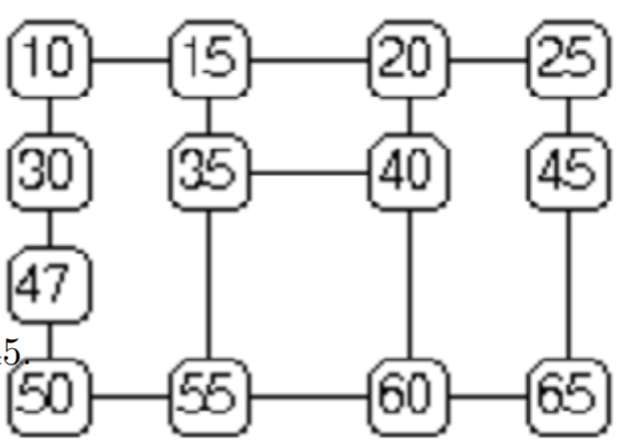

# 336 - A Node Too Far

https://onlinejudge.org/index.php?option=com_onlinejudge&Itemid=8&category=24&page=show_problem&problem=272

To avoid the potential problem of network messages (packets) looping around
forever inside a network, each message includes a Time To Live (TTL) field.
This field contains the number of nodes (stations, computers, etc.) that can
retransmit the message, forwarding it along toward its destination, before
the message is unceremoniously dropped. Each time a station receives a message
it decrements the TTL field by 1. If the destination of the message is the current
station, then the TTL field’s value is ignored. However, if the message must be forwarded,
and the decremented TTL field contains zero, then the message is not forwarded.

In this problem you are given the description of a number of networks, and for
each network you are asked to determine the number of nodes that are not reachable
given an initial node and TTL field value.

Consider the example network:



If a message with a TTL field of 2 was sent from node 35
it could reach nodes 15, 10, 55, 50, 40, 20 and 60. It could not
reach nodes 30, 47, 25, 45 or 65, since the TTL field would
have been set to zero on arrival of the message at nodes 10,
20, 50 and 60. If we increase the TTL field’s initial value to
3, starting from node 35 a message could reach all except node 45.

## Input
There will be multiple network configurations provided in the input. Each network description starts
with an integer NC specifying the number of connections between network nodes. An NC value of
zero marks the end of the input data. Following NC there will be NC pairs of positive integers. These
pairs identify the nodes that are connected by a communication line. There will be no more than
one (direct) communication line between any pair of nodes, and no network will contain more than 30
nodes. Following each network configuration there will be multiple queries as to how many nodes are
not reachable given an initial node and TTL field setting. These queries are given as a pair of integers,
the first identifying the starting node and the second giving the initial TTL field setting. The queries
are terminated by a pair of zeroes.

## Output
For each query display a single line showing the test case number (numbered sequentially from one),
the number of nodes not reachable, the starting node number, and the initial TTL field setting. The
sample input and output shown below illustrate the input and output format.

## Example

### Sample Input

```
16
10 15 15 20 20 25 10 30 30 47 47 50 25 45 45 65
15 35 35 55 20 40 50 55 35 40 55 60 40 60 60 65
35 2 35 3 0 0

14
1 2 2 7 1 3 3 4 3 5 5 10 5 11
4 6 7 6 7 8 7 9 8 9 8 6 6 11
1 1 1 2 3 2 3 3 0 0

0
```

### Sample Output

```
Case 1: 5 nodes not reachable from node 35 with TTL = 2.
Case 2: 1 nodes not reachable from node 35 with TTL = 3.
Case 3: 8 nodes not reachable from node 1 with TTL = 1.
Case 4: 5 nodes not reachable from node 1 with TTL = 2.
Case 5: 3 nodes not reachable from node 3 with TTL = 2.
Case 6: 1 nodes not reachable from node 3 with TTL = 3.
```
