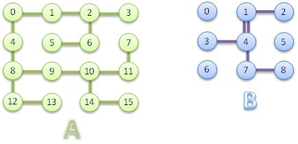

# Desenhando Labirintos

Pedro gosta muito de desenhar labirintos, e teve uma idéia recentemente: quantos movimentos com a caneta ele precisa fazer, no mínimo, para desenhar um labirinto, saindo sempre da mesma posição e finalizando no mesmo ponto? Para a brincadeira ficar interessante, Pedro decidiu que não é permitido levantar a caneta do papel. Os modelos para construção do labirinto são sempre quadrados, ou seja, 3 x 3 , 4 x 4 , 5 x 5 até no máximo de 7 x 7.

Para cada exemplo, Pedro vai especificar de onde o desenho deve começar e é tarefa sua determinar a quantidade de movimentos necessários para desenhar o labirindo como Pedro deseja. Pedro ainda lembra que você não precisa se preocupar com ciclos, pois não haverá nenhum ciclo em nenhum dos casos de teste. Se existir uma entrada 4 1, isso não impede a existência de outra entrada 1 4 no mesmo caso de teste, ou seja, outra linha ligando estes mesmos dois nodos. De qualquer forma isto não fará diferença no desenho do labirinto, pois se Pedro traçar as duas linhas entre 1 e 4 ou apenas uma delas, a quantidade de movimentos deverá ser a mesma. Somente neste caso, a utilização da segunda linha por Pedro é opcional.

Veja os exemplos abaixo, No labirinto A (4 x 4), Pedro deseja sair do nodo 0, desenhar todas as linhas e retornar ao nodo 0. Para isso, o mínimo de movimentos possíveis é 30. No labirinto B (3 x 3), Pedro deseja sair do nodo 1, desenhar  todas as linhas e retornar para o nodo 1. Neste caso, ele precisa de 10 movimentos para fazer este desenho.




## Entrada
A primeira linha de entrada é um inteiro T (T < 100) que indica o número total de casos de teste. Cada caso inicia com uma linha contendo um inteiro N (N < X2, onde X é a largura em nodos do labirinto, que pode variar de 3 até 7). Este N é o ponto (nodo) no qual o desenho deve ser iniciado e também é onde o desenho deve ser terminado. Na próxima linha há duas informações V e A que são respectivamente a quantidade de vértices e arestas do desenho. Uma quantidade A de linhas vem a seguir, cada uma descrevendo um segmento de linha que Pedro tem disponível para para desenhar o labirinto desejado.

## Saída
O arquivo de saída contém um valor para cada caso de teste de entrada. Este valor é a quantidade de movimentos de caneta que devem ser feitos para desenhar o labirinto do caso de teste, considerando que o início e o fim são sempre a partir do mesmo ponto (nodo) e que não é possível levantar a caneta do papel.

## Exemplo

In:

```
2
0
16 15
0 4
2 3
6 2
8 9
10 9
8 12
14 15
14 10
6 5
10 11
11 7
4 8
```

Out:
```
30
10
```
